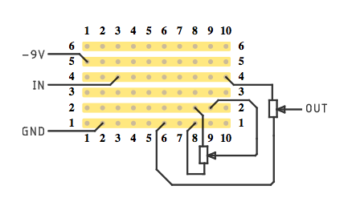

# eagle-stripboard

This repository contains an Eagle CAD user language program (ULP) that can
convert a PCB into a stripboard design. The design is created as one or more SVG
files.

## Installation

Clone the repository, and copy all *.ulp files into a directory of your choice.

## Stripboard design rules

To successfully create a stripboard design, the following conditions should be
met:

* all routing (pads, vias and bottom layer traces) should be on 100 mil grid
 (that is 1/10 inch or 2.54 mm). Small deviations from 100 mil grid are allowed
 (about ±0.3 mm)
* traces on bottom layer must be horizontal
* top layer traces can go in any direction, but they should not cross pads

## Running the ULP

After you have finished routing your PCB, enter `RUN ?` in the Eagle CAD command
line, and select `stripboard.ulp`. A dialog opens where you can configure your
stripboard design. For the first time, it is OK to just click `Generate and
close` button. That will create some SVG files in the board's directory and close
the dialog window. Read further to learn how to customize your stripboard
design.

## Customizing the output

### Views and layers

Similar to Eagle, stripboard design is separated into layers. There are 13
layers in total:

- *Strips*
- *Cuts* – contains the cuts you make into strips to create the traces. This layer
  is generated from the bottom side horizontal traces of your PCB
- *Wires* – contains the wires you solder into the stripboard. This layer is
  generated from the top side tarces of your PCB
- *Top components outlines* – contains the graphics from components footprints
  on the top side of the PCB. This includes Eagle layers 21 and 51
- *Bottom components outlines* – contains the graphics from components footprints
  on the bottom side of the PCB. This includes Eagle layers 22 and 52
- *Top components names* – contains the names of the components on the top side
  of the PCB. This includes Eagle layer 25
- *Top components values* – contains the values of the components on the top side
  of the PCB. This includes Eagle layer 27
- *Bottom components names* – contains the names of the components on the bottom side
  of the PCB. This includes Eagle layer 26
- *Bottom components values* – contains the values of the components on the
  bottom side of the PCB. This includes Eagle layer 28
- *Top board graphics* – contains the graphics you placed on the board on layers
  21, 25, 27 and 51
- *Bottom board graphics* – contains the graphics you placed on the board on layers
  22, 26, 28 and 52
- *Top board text* – contains the text you placed on the board on layers
  21, 25, 27 and 51
- *Bottom board text* – contains the text you placed on the board on layers
  22, 26, 28 and 52

*View* is a collection of layers. Each view generates its own SVG file. Strips
layer is always visible. You can create as many views as you wish, and for each
view you specify the layers you want. Each view can represent either the top
side or the bottom side of the board.

By default, 6 views are created:

- *Combined* – a view that shows the general stripboard design as seen from the
  top. It contains*Cuts*, *Wires*, *Top components outlines* and *Bottom
  components*
- *Cuts* - a view that show the cuts into the strips as seen from the bottom
- *Wires* - a view that show the wires to solder into the board as seen from
  the top
- *Top components* – a view that show placecement of components on the top of
  the board. It contains *Top components outlines* and *Top values*
- *Bottom components* – a view that show placecement of components on the bottom of
  the board. It contains *Bottom components outlines* and *Bottom values*
- *Graphics* – a view that show the graphics and text placed on the board. This
  view contains *Top board graphics* and *Top board text* layers. This view can
  be used, for example, to show the board's external connections.

### Changing views

The default views are often a good start, but you may have your own preferences.
In that case you can edit the default views or create new ones. To edit a view,
select it from the list, and click *Edit view*.  Another dialog opens where you
can set the view name and the layers to include. Also you can choose the side
of the board – top or bottom.

To add a new view, click *Add* and use the same dialog to create a new view.

If you do not need a particular view, select it and click *Delete*.

### Cutting methods

Traditionally cuts into the strips are made by drilling out the holes with a
drill bit slighly bigger that strip width. That breaks the strip into traces.
There is also another way to break the strips, by cutting them between the holes
with a scalpel of an utility knife. Both methods are good, but cutting between
traces allows better board density and components placing freedom. With 
between-holes cutting, it is not possible to place, for example, a capacitor
with 2.5 mm pin spacing in horizontal direction so both pins are on the same
strip – there is no hole between the pins to drill out. 

Whatever cutting method you prefer, this ULP supports them both. Just select the
method you need before generating the files.

## Example

Popular __Fuzz face__  guitar pedal on a stripboard

